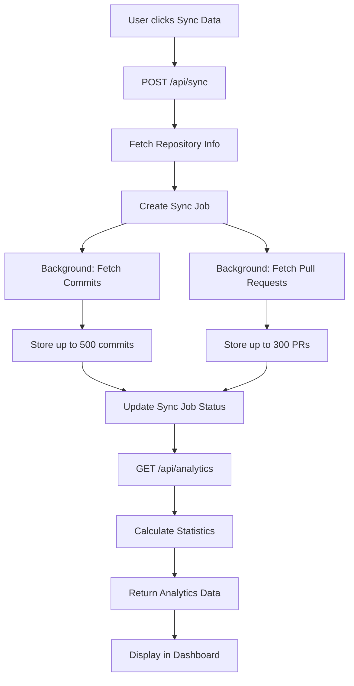

# 🚀 GitHub Repository Manager

> A comprehensive, beautiful dashboard for managing GitHub repositories with advanced analytics and metadata extraction

<div align="center">


[Features](#-features) • [Demo](#-demo) • [Installation](#-installation) • [Usage](#-usage) • [Tech Stack](#-tech-stack)

</div>

---

## ✨ Features

### 🔐 Secure Authentication
- Token-based authentication with GitHub Personal Access Tokens
- Local storage only (never sent to external servers)
- Beautiful animated login page

### 📊 Repository Management
- View all repositories (public & private)
- Real-time search and filtering
- Create new repositories with descriptions
- Delete repositories with confirmation
- Filter by visibility (All/Public/Private)

### 📈 Advanced Analytics & Metadata Extraction
**The core feature** - Extract and analyze commit & pull request metadata:

#### Commit Analytics
- 📊 Total commits with trend analysis
- ➕ Code additions tracking
- ➖ Code deletions tracking
- 📁 Files changed statistics
- 📉 30-day commit trend visualization
- 👥 Average changes per commit

#### Pull Request Insights
- 🔀 Total PRs (open/closed/merged)
- 📊 Merge rate percentage
- ⏱️ Average merge time calculation
- 📈 PR state distribution

#### Contributor Analytics
- 🏆 Top contributors leaderboard
- 📊 Commit count per contributor
- 📈 Code contribution metrics

### 🔗 Webhook Management
- Create webhooks for real-time notifications
- Configure multiple event types (push, pull_request, issues, etc.)
- Enable/disable webhooks on-the-fly
- Delete webhooks with confirmation

### 📝 Gist Manager
- View all your gists
- Create new gists with syntax highlighting
- Public/Secret gist options
- Multi-file support
- One-click deletion

### 🔔 Notifications Center
- View all GitHub notifications
- Filter by unread/all
- Mark individual or all as read
- Direct links to GitHub
- Notification type indicators

### 🎨 Beautiful UI/UX
- 🌙 Modern dark mode design
- 📱 Fully responsive (mobile/tablet/desktop)
- ✨ Smooth animations and transitions
- 🎭 Glass morphism effects
- 🎨 Gradient backgrounds
- 🎯 Intuitive navigation

---

## 🎬 Demo

### Landing Page
Beautiful gradient background with feature showcase and secure token input.

### Dashboard
Comprehensive overview with stats cards, recent repositories, and quick actions.

### Analytics
Deep insights into your repository activity with visual charts and statistics.

---

## 🚀 Installation

### Prerequisites
- Node.js 18+ installed
- GitHub account
- GitHub Personal Access Token

### Quick Start

1. **Clone the repository**
   ```bash
   git clone https://github.com/yourusername/git-manager.git
   cd git-manager/git-app
   ```

2. **Install dependencies**
   ```bash
   npm install
   ```

3. **Set up the database**
   ```bash
   npx prisma generate
   npx prisma migrate dev --name init
   ```

4. **Start the development server**
   ```bash
   npm run dev
   ```

5. **Open your browser**
   ```
   http://localhost:3000
   ```

---

## 🔑 Getting Your GitHub Token

1. Go to [GitHub Settings → Developer Settings → Personal Access Tokens](https://github.com/settings/tokens/new)
2. Click **"Generate new token (classic)"**
3. Give it a descriptive name (e.g., "Repo Manager Dashboard")
4. Select the following scopes:
   - ✅ `repo` - Full control of private repositories
   - ✅ `workflow` - Update GitHub Action workflows
   - ✅ `admin:repo_hook` - Full control of repository hooks
   - ✅ `admin:org_hook` - Full control of organization hooks
   - ✅ `gist` - Create gists
   - ✅ `notifications` - Access notifications
   - ✅ `user` - Update ALL user data
   - ✅ `delete_repo` - Delete repositories
5. Click **"Generate token"**
6. **Copy the token** (you won't see it again!)
7. Paste it into the application login page

---

## 📖 Usage

### 1. Authentication
- Open the application
- Paste your GitHub Personal Access Token
- Click "Connect to GitHub"

### 2. Explore Dashboard
- View your repository statistics
- See recent repositories
- Access quick action cards

### 3. Sync Repository Data
1. Navigate to **Analytics** page
2. Select a repository from the dropdown
3. Click **"Sync Data"** button
4. Wait 10-60 seconds for data extraction
5. View comprehensive analytics:
   - Commit trends and statistics
   - Pull request metrics
   - Top contributor insights
   - Code change analysis

### 4. Manage Repositories
- Browse, search, and filter repositories
- Create new repositories
- Delete repositories (with confirmation)

### 5. Configure Webhooks
- Select a repository
- Create webhooks with custom URLs
- Choose event triggers
- Enable/disable as needed

### 6. Create Gists
- Navigate to Gists page
- Click "New Gist"
- Add filename and content
- Choose public or secret
- Share your code snippets!

### 7. Monitor Notifications
- View all GitHub notifications
- Filter by unread
- Mark as read individually or in bulk

---

## 🛠️ Tech Stack

### Frontend
- **Framework**: [Next.js 14](https://nextjs.org/) (App Router)
- **Language**: [TypeScript](https://www.typescriptlang.org/)
- **Styling**: [Tailwind CSS v3](https://tailwindcss.com/)
- **Icons**: [Lucide React](https://lucide.dev/)
- **HTTP Client**: [Axios](https://axios-http.com/)

### Backend
- **Database**: [SQLite](https://www.sqlite.org/)
- **ORM**: [Prisma](https://www.prisma.io/)
- **API**: [Next.js API Routes](https://nextjs.org/docs/api-routes/introduction)

### Development
- **Package Manager**: npm
- **Linting**: ESLint
- **Formatting**: Prettier (optional)

---

## 📁 Project Structure

```
git-app/
├── app/
│   ├── api/
│   │   ├── sync/route.ts          # Data extraction endpoint
│   │   └── analytics/route.ts     # Analytics endpoint
│   ├── dashboard/
│   │   ├── layout.tsx             # Dashboard layout
│   │   ├── page.tsx               # Dashboard home
│   │   ├── repositories/          # Repository management
│   │   ├── analytics/             # Analytics dashboard
│   │   ├── webhooks/              # Webhook management
│   │   ├── gists/                 # Gist manager
│   │   └── notifications/         # Notifications center
│   ├── layout.tsx                 # Root layout
│   ├── page.tsx                   # Landing page
│   └── globals.css                # Global styles
├── components/
│   └── TokenInput.tsx             # Authentication component
├── contexts/
│   └── AuthContext.tsx            # Authentication context
├── lib/
│   ├── github.ts                  # GitHub API client
│   ├── prisma.ts                  # Prisma client
│   └── utils.ts                   # Utility functions
├── prisma/
│   ├── schema.prisma              # Database schema
│   └── migrations/                # Database migrations
└── public/                        # Static assets
```

---

## 🗄️ Database Schema

```prisma
model Repository {
  id           String        @id @default(cuid())
  githubId     Int           @unique
  name         String
  fullName     String
  description  String?
  private      Boolean
  // ... more fields
  commits      Commit[]
  pullRequests PullRequest[]
  webhooks     Webhook[]
}

model Commit {
  id            String     @id @default(cuid())
  sha           String     @unique
  message       String
  author        String
  additions     Int
  deletions     Int
  // ... more fields
  repository    Repository @relation(...)
}

model PullRequest {
  id            String     @id @default(cuid())
  githubId      Int        @unique
  number        Int
  title         String
  state         String
  merged        Boolean
  // ... more fields
  repository    Repository @relation(...)
}

model Webhook {
  id          String     @id @default(cuid())
  githubId    Int        @unique
  active      Boolean
  events      String     // JSON array
  // ... more fields
  repository  Repository @relation(...)
}

model SyncJob {
  id             String   @id @default(cuid())
  type           String
  status         String
  itemsProcessed Int
  // ... more fields
}
```

---

## 🔄 Data Synchronization Flow



---

## 🚀 Deployment

### Vercel (Recommended)

1. Push your code to GitHub
2. Visit [Vercel](https://vercel.com)
3. Import your repository
4. Deploy with one click

### Docker

```dockerfile
FROM node:18-alpine
WORKDIR /app
COPY package*.json ./
RUN npm install
COPY . .
RUN npx prisma generate
RUN npm run build
EXPOSE 3000
CMD ["npm", "start"]
```

### Environment Variables

Create a `.env` file:
```env
DATABASE_URL="file:./dev.db"
```

---

## 🎯 Use Cases

- 📊 **Team Analytics**: Track team productivity and contributions
- 🔍 **Project Monitoring**: Monitor multiple projects from one dashboard
- 📈 **Code Review Metrics**: Analyze PR merge times and patterns
- 🏆 **Contributor Recognition**: Identify top contributors
- 🔗 **CI/CD Integration**: Use webhooks to trigger builds
- 📝 **Code Audit**: Track code changes over time
- 💼 **Portfolio Dashboard**: Showcase your repositories

---

## 🤝 Contributing

Contributions are welcome! Please feel free to submit a Pull Request.

1. Fork the repository
2. Create your feature branch (`git checkout -b feature/AmazingFeature`)
3. Commit your changes (`git commit -m 'Add some AmazingFeature'`)
4. Push to the branch (`git push origin feature/AmazingFeature`)
5. Open a Pull Request

---

## 📄 License

This project is licensed under the MIT License - see the [LICENSE](LICENSE) file for details.

---

## 🙏 Acknowledgments

- [GitHub API](https://docs.github.com/en/rest) for comprehensive access
- [Next.js](https://nextjs.org/) for the amazing framework
- [Tailwind CSS](https://tailwindcss.com/) for beautiful styling
- [Prisma](https://www.prisma.io/) for excellent database toolkit
- [Lucide](https://lucide.dev/) for beautiful icons

---

## 📞 Support

For issues or questions:
- 🐛 [Open an issue](https://github.com/yourusername/git-manager/issues)
- 💬 [Start a discussion](https://github.com/yourusername/git-manager/discussions)

---

## 🌟 Star History

If you find this project useful, please consider giving it a star ⭐

---

<div align="center">

**Built with ❤️ using Next.js, TypeScript, and Tailwind CSS**

[⬆ Back to Top](#-github-repository-manager)

</div>
